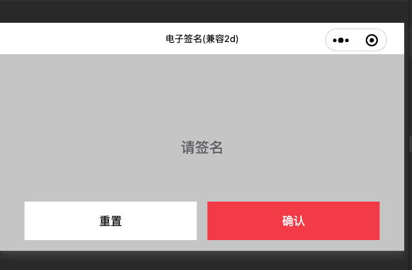

# wxMiniCanvasSignture
小程序canvas电子签名(兼容2d)



+ Usage
```bash
npm i wx_mini_signture
```
```json
// index.json
{
    "pageOrientation": "landscape",
    "usingComponents": {
        "demo": "wx_mini_signture"
    }
}
```

```html
<view style="width: 100vw;height: 100vh; overflow: hidden;">
    <demo />
</view>
```


## TODO
- [x] 实现旧版canvas签名
- [x] 实现canvas 2d签名
- [x] 打包发布npm
- [ ] 切换2d模式(当前默认使用canvas 2d)
