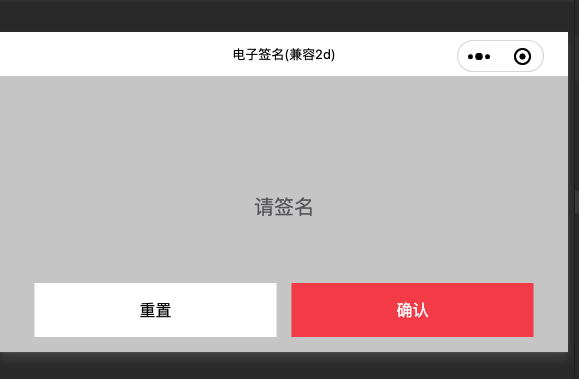

<!--
 * @Author: June
 * @Description: 
 * @Date: 2023-02-03 17:30:28
 * @LastEditors: June
 * @LastEditTime: 2023-02-05 23:38:09
-->
# wxMiniCanvasSignture
小程序canvas电子签名(兼容2d)



+ Usage
```bash
npm i wx_mini_signture
```
```json
// index.json
{
    "pageOrientation": "landscape",
    "usingComponents": {
        "demo": "wx_mini_signture"
    }
}
```

```html
<!-- canvasType="2d" 是用canvas 2d , 要用旧的可以不用canvasType这个属性 -->
<view style="width: 100vw;height: 100vh; overflow: hidden;">
    <demo
        canvasType="2d"
        bind:signtureConfirm="onConfirm"
    />
</view>
```

```javascript
Page({
    onConfirm(e) {
        console.log(e)
    }
})
```

## TODO
- [x] 实现旧版canvas签名
- [x] 实现canvas 2d签名
- [x] 打包发布npm
- [x] 切换2d模式(当前默认使用canvas 2d)
